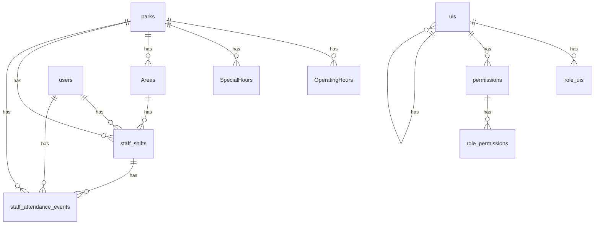
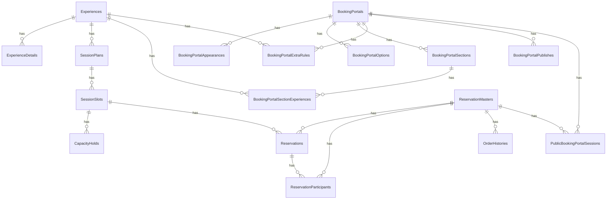
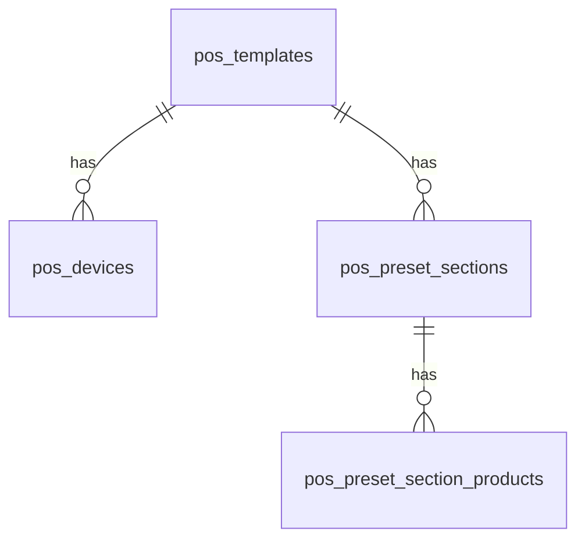
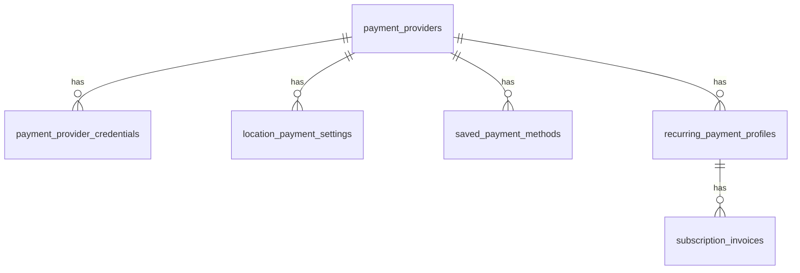
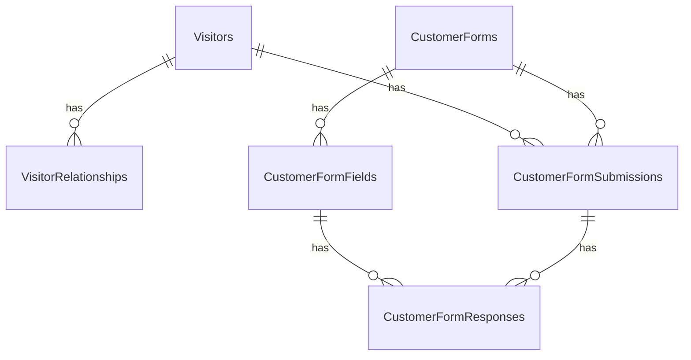
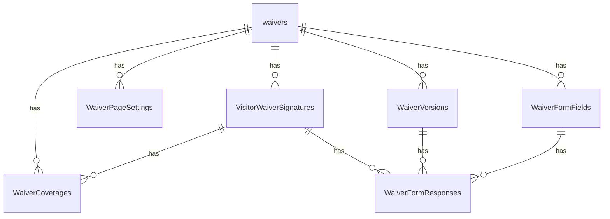
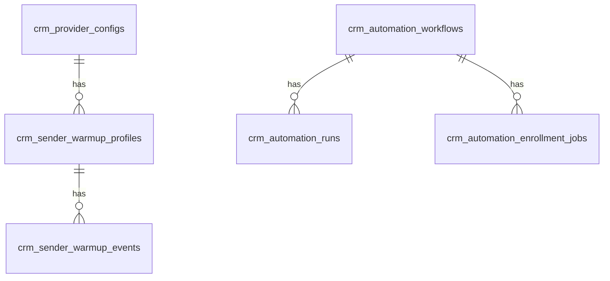

```mermaid
erDiagram
  crm_transactional_messages ||--o{ crm_transactional_delivery_events : "has"
  crm_email_domains ||--o{ crm_email_domain_routes : "has"
  crm_marketing_folders ||--o{ crm_marketing_assets : "has"
  crm_marketing_templates ||--o{ crm_marketing_messages : "has"
  crm_marketing_templates ||--o{ crm_marketing_template_revisions : "has"
  crm_marketing_templates ||--o{ crm_marketing_campaign_audience_jobs : "has"
  crm_marketing_campaigns ||--o{ crm_marketing_messages : "has"
  crm_marketing_campaigns ||--o{ crm_marketing_delivery_events : "has"
  crm_marketing_campaigns ||--o{ crm_marketing_suppressions : "has"
  crm_marketing_campaigns ||--o{ crm_marketing_campaign_audience_jobs : "has"
  crm_marketing_messages ||--o{ crm_marketing_delivery_events : "has"
  crm_marketing_messages ||--o{ crm_marketing_suppressions : "has"
  crm_contacts ||--o{ crm_contact_identities : "has"
  crm_contacts ||--o{ crm_segment_members : "has"
  crm_contacts ||--o{ crm_contact_notes : "has"
  crm_segments ||--o{ crm_segment_members : "has"
  crm_marketing_calendar_plans ||--o{ crm_marketing_calendar_rules : "has"
  crm_marketing_calendar_plans ||--o{ crm_marketing_calendar_overrides : "has"
```

# Application Database ER Diagrams

While the codebase is split across 4 directories (CRM, Cashier, my-admin-app, aeroSportsAdmin), they all share a single PostgreSQL database. For better readability, the tables have been logically grouped into **8 Business Modules**.

This document contains the ER diagrams (in Mermaid syntax) and lists the "Isolated Tables" (tables without formal Foreign Key constraints) for each module.

---

## 1. Venues, Staff & System Administration

### Diagram

### Isolated Tables
These tables belong to the module but do not have formal Foreign Key constraints connecting them to other tables in this module.

- `SequelizeMeta`
- `admin_locations`
- `break_rules`
- `chat_channel_messages`
- `chat_channel_read_markers`
- `chat_conversations`
- `chat_messages`
- `hr_document_assignments`
- `hr_document_signatures`
- `hr_documents`
- `leave_balances`
- `leave_requests`
- `leave_types`
- `location_geofences`
- `location_permanent_delete_audits`
- `location_scheduling_settings`
- `manager_override_audits`
- `member_accounts`
- `open_shifts`
- `payment_credential_audit_log`
- `payment_transaction_events`
- `payment_webhook_events`
- `processlog`
- `roles`
- `shift_swaps`
- `shift_templates`
- `staff_availability_windows`
- `staff_timesheets`
- `support_ticket_messages`
- `support_tickets`
- `timesheet_edit_requests`
- `user_sessions`

---

## 2. Bookings & Experiences

### Diagram

### Isolated Tables
These tables belong to the module but do not have formal Foreign Key constraints connecting them to other tables in this module.

- `ActivityAreaRules`
- `ExperienceTypes`
- `Sessions`
- `booking_staff_assignments`
- `eventbookings`
- `public_schedules`
- `tmpeventbookings`

---

## 3. POS & Terminals

### Diagram

### Isolated Tables
These tables belong to the module but do not have formal Foreign Key constraints connecting them to other tables in this module.

- `WristbandColors`
- `WristbandProductExclusions`
- `WristbandProductOverrides`
- `payment_terminals`
- `pos_settings`
- `terminal_sales`
- `wristbands`

---

## 4. Payments, Memberships & Tickets

### Diagram

### Isolated Tables
These tables belong to the module but do not have formal Foreign Key constraints connecting them to other tables in this module.

- `BenefitApplications`
- `Entitlements`
- `GiftCardRedemptions`
- `GiftCards`
- `Memberships`
- `PaymentTransactions`
- `TicketHolderBindings`
- `TicketRedemptions`
- `TicketTypes`
- `Tickets`
- `payment_allocations`
- `promos`
- `refunds`
- `tax_rates`
- `tip_distribution_shares`
- `tip_distributions`
- `tips`

---

## 5. Customers & Forms

### Diagram

### Isolated Tables
These tables belong to the module but do not have formal Foreign Key constraints connecting them to other tables in this module.

- `BookingPortalVisitorFields`
- `CustomerFlags`
- `CustomerNotes`
- `customers`
- `tmpcustomers`

---

## 6. Waivers & Compliance

### Diagram

### Isolated Tables
These tables belong to the module but do not have formal Foreign Key constraints connecting them to other tables in this module.

- `tmpwaivers`
- `waiver`

---

## 7. CRM Marketing & Contacts

### Diagram

### Isolated Tables
These tables belong to the module but do not have formal Foreign Key constraints connecting them to other tables in this module.

- `crm_contact_fields`
- `crm_contact_filter_counts`
- `crm_contact_tags`
- `crm_email_reply_forward_settings`
- `crm_event_template_bindings`
- `crm_marketing_snippets`
- `crm_transactional_templates`
- `crm_trigger_links`

---

## 8. CRM Automation & Infrastructure

### Diagram

### Isolated Tables
These tables belong to the module but do not have formal Foreign Key constraints connecting them to other tables in this module.

- `crm_audit_logs`
- `crm_contact_bulk_action_jobs`
- `crm_contact_export_jobs`
- `crm_contact_import_jobs`
- `crm_marketing_worker_heartbeats`
- `crm_queue_jobs`

---

